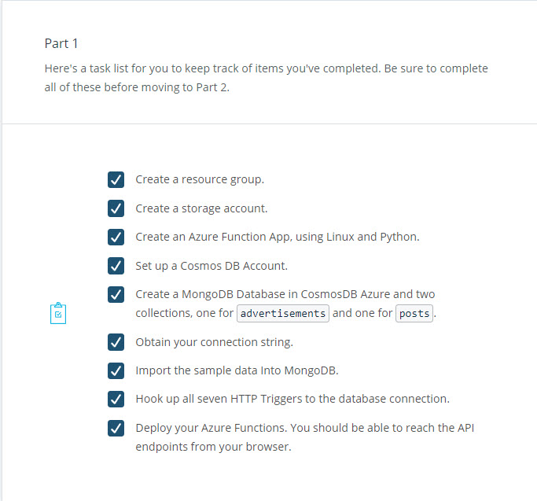
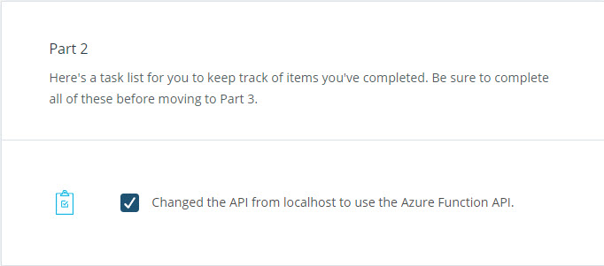
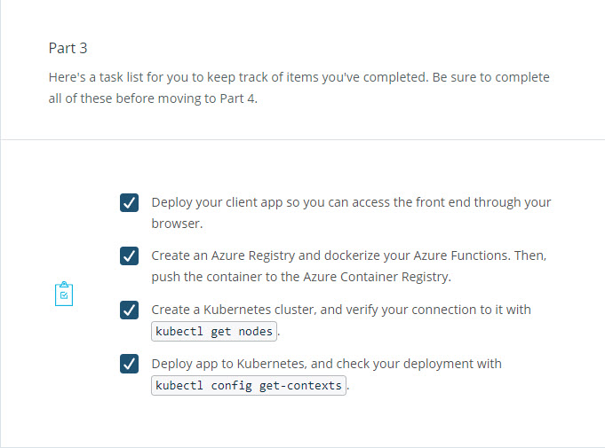
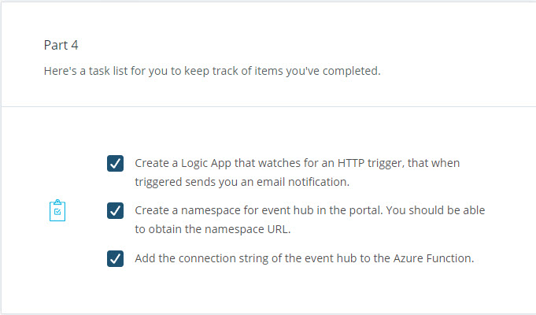
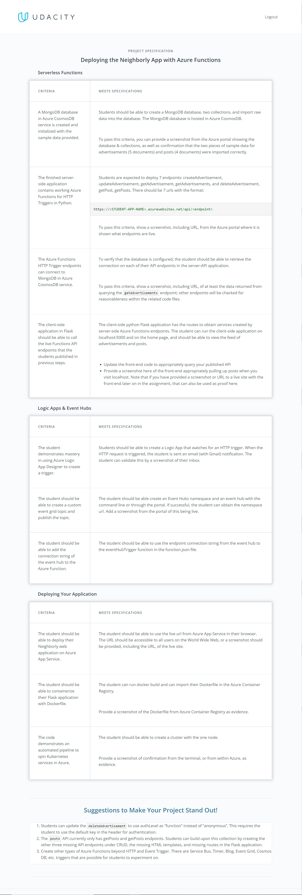

# Neighborly App with Azure Functions
<i>Cloud Developer using Microsoft Azure Nanodegree Program</i>

Impossible odds make satisfying achievements. 🤯

I would like to present my final project for the Azure Microservices section. 

This project builds an app called "Neighborly". Neighborly is a Python Flask-powered web application that allows neighbors to post advertisements for services and products they can offer.

The Neighborly project is comprised of a front-end application that is built with the Python Flask micro framework. The application allows the user to view, create, edit, and delete the community advertisements.

The application makes direct requests to the back-end API endpoints. These are endpoints that we will also build for the server-side of the application.

Let's deploy an app called Neighborly, allowing neighbors to post advertisements for services and products they can offer. The app will use a blend of Cosmos DB, Azure Functions, Kubernetes, Event Hub, Event Grid Topic, and more.

## Summary

This project has the following parts:

- Creating an Azure Function App

- Deploying the Client-Side Flask Web Application

- CI/CD Deployment

- Event Hubs and Logic App

## Demo Videos

- This is a short demo of how to create and utilize a deployment yaml file for an Azure function app to an existing Kubernetes service. Also, we show another option of deploying directly to Kubernetes from a Docker container residing on the Azure Container Registry. Lastly, we tour through our deployment running on a Kubernetes service with the Azure portal.

- This is a short demo of how we can publish an event to Azure's Event Grid using a Postman post request that gets sent to an event hub space and topic. The project has an Azure function app with a specific event hub trigger that runs when there is a new event with our topic and processes that event data. We examine the event hub activity and setup in the Azure portal. 

## Udacity 

I passed and my project met all specifications that are documented in files and screen captures [here](https://github.com/kathleenwest/azure-microservices-functions-kubernetes-demo-project/tree/main/demo). Also reference the demo videos above for a walk through of how my project was setup in Azure and see this link for how my project [met specifications](images/meetsspecifications.jpg).

[Udacity Project Step-By-Step Instructions](DeployingtheNeighborlyAppwithAzureFunctions.md)

[Starter Code Repository](https://github.com/udacity/nd081-c2-Building-and-deploying-cloud-native-applications-from-scratch-project-starter)

## Grading Rubric

